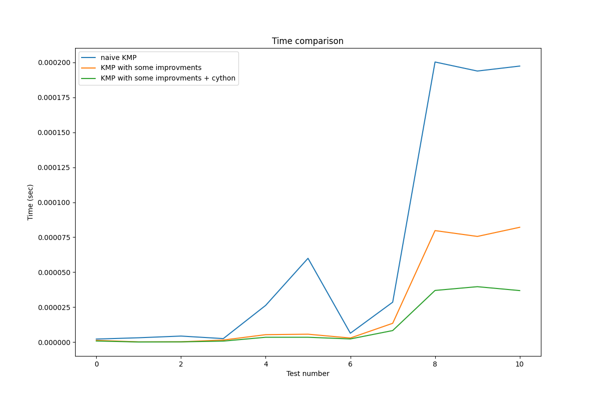

# Задача поиска подстроки в строке
# Алгоритм Кнута — Морриса — Пратта
**Сложность**: O(n)

Время работы алгоритма линейно зависит от объёма входных данных, то есть разработать асимптотически более эффективный алгоритм **невозможно**.

# Quick start
- `python setup_cython.py build_ext --inplace`
- `python kmp_algorithm.py`
- open time_comparison.png

# Ход работы
В ходе работы было разработано 3 реализации алгоритма КМП. 
1) Наивный алгоритм как он есть 
2) Внесены микрооптимизации для ускорения вычислений
    - подсчет длин строк вынесен в начало функции, сохраняется в переменные и не вызывается нескольно раз по ходу выполнения
    - Добавлено сравнение длины строки и подстроки. Если подстрока больше, то нет смысла выполнять алгоритм, можно сразу вернуть -1 (подстрока не встречается в строке)
3) Функция с микрооптимизациями скомпилирована с Cython и вызывается в python коде как модуль

Результаты сравнения работы функций можно посмотреть на рисунке:

# Выводы
- Алгоритм уже является эффективным с точки зрения аналитической сложности - O(N).
- Благодаря сохранению повторяющихся в цикле вычислений и отсечению крайнего случая удалось существенно ускорить алгоритм на относительно больших тестах. 
- Использование Cython позволило транслировать функцию в язык программирования C и сохранить расширение для запуска C кода изнутри python. Такая программная оптимизация также позволила увеличить скорость работы, но уже не так сильно как оптимизации из п. 2