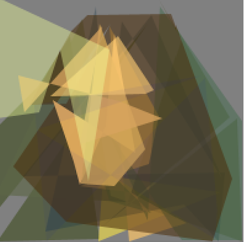

# Лабораторная работа №2 Введение в эволюционные вычисления
## Цель работы
Целью данной лабораторной работы является получение студентом представления об возможностях применения эволюционных алгоритмов для решения различных классов задач и программных средств для их разработки.

## Оборудование и программное обеспечение
- браузер с доступом к сети Интернет
- Java JDK версии 1.8 и выше
- Watchmaker framework версии 0.7.1

## Ход работы
### Подготовка
Склонируем репозиторий https://github.com/dwdyer/watchmaker и откроем его в Intellij Idea с JDK >=1.8
Структура репозитория:

### Bits count
- Задача: посчитать кол-во битов в строке заданной длины. Алгоритм останавливается, когда находит оптимальное значение
- [Script](./watchmaker/examples/src/java/main/org/uncommons/watchmaker/examples/bits/BitsExample.java)
- Решения закодированы битовыми строками (BitString - реализация битовой строки фиксированной длины в Java)

### Travelling salesman problem
- Задача: найти кратчайший путь, проходящий через все точки (города)
- [Script](./watchmaker/examples/src/java/main/org/uncommons/watchmaker/examples/travellingsalesman/TravellingSalesmanApplet.java)

|Setection strategy|	Population size|	Elitism|	Number of generations|	Distance|	Time*| Route|
|---|---|---|---|---|---|---|
|Truncation|300|3|100|**10494.0km**|0.058s|Lisbon -> Madrid -> Rome -> Athens -> Vienna -> Berlin -> Helsinki -> Stockholm -> Copenhagen -> Amsterdam -> Brussels -> Luxembourg -> Paris -> London -> Dublin -> Lisbon
|Truncation|300|3|500|**10494.0km**|0.248s|Luxembourg -> Paris -> London -> Dublin -> Lisbon -> Madrid -> Rome -> Athens -> Vienna -> Berlin -> Helsinki -> Stockholm -> Copenhagen -> Amsterdam -> Brussels -> Luxembourg|
|Truncation|500|3|100|**10494.0km**|0.105s|Rome -> Madrid -> Lisbon -> Dublin -> London -> Paris -> Luxembourg -> Brussels -> Amsterdam -> Copenhagen -> Stockholm -> Helsinki -> Berlin -> Vienna -> Athens -> Rome|
|Rank|500|3|100|**10494.0km**|0.089s|Vienna -> Berlin -> Helsinki -> Stockholm -> Copenhagen -> Amsterdam -> Brussels -> Luxembourg -> Paris -> London -> Dublin -> Lisbon -> Madrid -> Rome -> Athens -> Vienna|
|Tournament|500|3|100|10615.0km|0.091s|Paris -> London -> Dublin -> Lisbon -> Madrid -> Rome -> Athens -> Vienna -> Helsinki -> Stockholm -> Copenhagen -> Berlin -> Amsterdam -> Brussels -> Luxembourg -> Paris|
|Stochastic Universal Sampling|500|100|3|11418.0km|0.095s|Stockholm -> Copenhagen -> Paris -> London -> Dublin -> Lisbon -> Madrid -> Rome -> Athens -> Vienna -> Luxembourg -> Brussels -> Amsterdam -> Berlin -> Helsinki -> Stockholm|
|Stochastic Universal Sampling|500|100|8|**10494.0km**|0.083s|Helsinki -> Berlin -> Vienna -> Athens -> Rome -> Madrid -> Lisbon -> Dublin -> London -> Paris -> Luxembourg -> Brussels -> Amsterdam -> Copenhagen -> Stockholm -> Helsinki|

*указано среднее время по 3 запускам
- Population size. Отвечает за начальный размер популяции. Чем больше размер популяции, тем дольше работает алгоритм
- Elitism. Отвечает за копирование небольшого числа наиболее подходящих кандидатов, в следующее поколение. В экспериментах, представленных в таблице, видно, что при увеличении значения этого параметра, результат становится лучше на некоторых selection strategy.
- Number of generations. Отвечает за кол-во поколений. Чем выше значение, тем дольше работает, но вероятнее сойдется к лучшему решению. 

### Mona Lisa
- Задача: Построить из полупрозрачных многоугольников картину, напоминающую Мона Лизу.
- [Script](./watchmaker/examples/src/java/main/org/uncommons/watchmaker/examples/monalisa/MonaLisaApplet.java)

|Качество|Итерация|Фитнес|Кол-во полигонов/углов|Фото|
|---|---|---|---|---|
|Оригинал||||
|Плохое|3757|352616.9|13/90|
|Среднее|3757|222741.2|30/199|
|Хорошее|3757|189899.0|48/357|

## Q/A
1. К какому типу по структуре решений относится каждая из рассмотренных задач?
- BitsCount - бинарный
- Travelling salesman problem - древовидный
- Mona Lisa - комбинаторный
2. Как закодированы решения в задаче комивояжера?
- Протяженность маршрута - fitness 
- Список городов в заданном порядке - решения
3. Что в задаче Mona Lisa является генотипом и фенотипом?
- Генотип - набор многоугольников
- Фенотип - изображение
